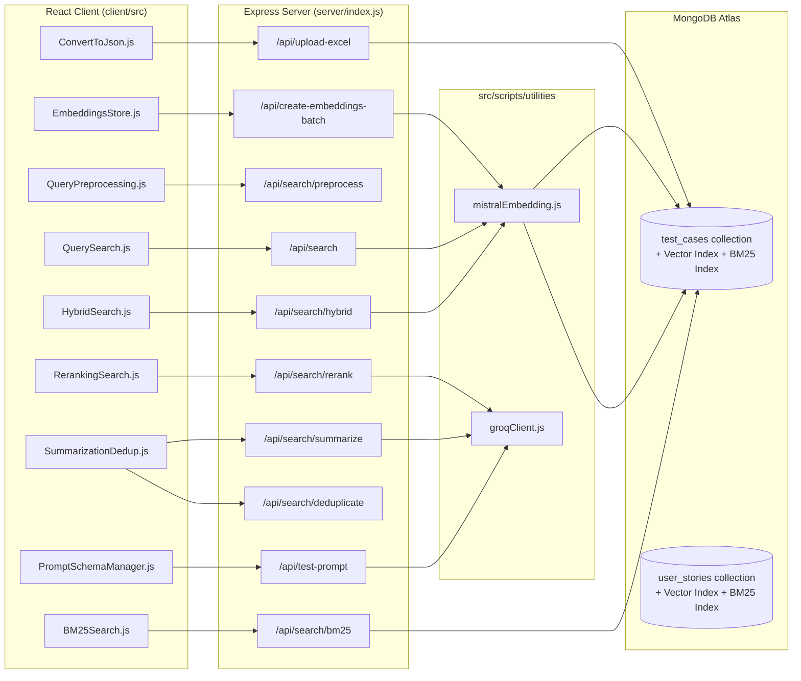

# RAG Mongo Demo — Ingestion, Retrieval & Augmentation Guide

A full-stack RAG (Retrieval-Augmented Generation) pipeline demo for healthcare **Test Cases** and **User Stories**, built on **MongoDB Atlas Vector Search + Atlas Search (BM25)**, **Mistral AI** embeddings, and **Groq AI** LLMs for reranking/summarization.

This document explains the **end-to-end application flow** — Ingestion → Retrieval → Augmentation — with every frontend/backend file involved, the exact prompts used (with file + line numbers), and how each search technique (Vector, BM25, Hybrid, Reranking, Deduplication, Summarization) is implemented.

---

## 1. Tech Stack

| Layer | Technology |
|---|---|
| Frontend | React 18, MUI (Material UI) v5, `@mui/x-data-grid`, `notistack`, `axios` / `fetch` |
| Backend | Node.js (ESM), Express, `multer` (file upload), `child_process.spawn` (script execution) |
| Database | MongoDB Atlas — Vector Search (`$vectorSearch`) + Atlas Search / BM25 (`$search`) |
| Embeddings | Mistral AI `mistral-embed` (1024 dimensions, cosine similarity) |
| LLM (rerank/summarize/answer) | Groq AI (`groq-sdk`) — `llama-3.3-70b-versatile` (summarization/QA), `llama-3.2-3b-preview` / configurable via `GROQ_RERANK_MODEL` (reranking) |
| Data conversion | `xlsx` (Excel → JSON) |
| Concurrency | `p-limit` (batch embedding rate limiting) |
| Legacy/reference scripts | OpenAI-compatible "Testleaf" embedding API, HuggingFace `cross-encoder/ms-marco-MiniLM-L-6-v2` (CrossEncoder reranking) |

Key packages: [package.json](package.json)

---

## 2. High-Level Architecture



---

## 3. INGESTION Flow (Excel → JSON → Embeddings → MongoDB)

### 3.1 Steps
1. User uploads an Excel file (Test Cases or User Stories) in the UI.
2. Backend converts Excel rows to JSON using the `xlsx` library.
3. User selects the JSON file(s) and triggers embedding creation.
4. Backend generates vector embeddings via **Mistral AI** and bulk-inserts documents (with the `embedding` field) into MongoDB Atlas.

### 3.2 Frontend files

| File | Responsibility |
|---|---|
| [client/src/components/data/ConvertToJson.js](client/src/components/data/ConvertToJson.js) | Excel upload UI. Posts `multipart/form-data` to `/api/upload-excel` — see [ConvertToJson.js:143](client/src/components/data/ConvertToJson.js#L143) |
| [client/src/components/data/EmbeddingsStore.js](client/src/components/data/EmbeddingsStore.js) | Lists JSON files (`GET /api/files`, [EmbeddingsStore.js:57](client/src/components/data/EmbeddingsStore.js#L57)), lets user pick files and kicks off batch embedding via `POST /api/create-embeddings-batch` ([EmbeddingsStore.js:231](client/src/components/data/EmbeddingsStore.js#L231)); auto-selects `create-embeddings-batch-mistral.js` or `create-userstories-embeddings-batch-mistral.js` based on filename ([EmbeddingsStore.js:212-225](client/src/components/data/EmbeddingsStore.js#L212-L225)); polls `GET /api/jobs/:jobId` every 2s for progress ([EmbeddingsStore.js:99-132](client/src/components/data/EmbeddingsStore.js#L99-L132)) |

### 3.3 Backend files

| File | Responsibility |
|---|---|
| [server/index.js](server/index.js) | Express API — see routes below |
| [src/scripts/utilities/mistralEmbedding.js](src/scripts/utilities/mistralEmbedding.js) | Mistral AI embedding client |
| [src/scripts/embeddings/create-embeddings-batch-mistral.js](src/scripts/embeddings/create-embeddings-batch-mistral.js) | Batch embedding job for **Test Cases** |
| [src/scripts/embeddings/create-userstories-embeddings-batch-mistral.js](src/scripts/embeddings/create-userstories-embeddings-batch-mistral.js) | Batch embedding job for **User Stories** |
| [src/config/testcases-vector-index.json](src/config/testcases-vector-index.json) / [testcases-bm25-index.json](src/config/testcases-bm25-index.json) | Atlas index definitions for `test_cases` |
| [src/config/user-stories-vector-index.json](src/config/user-stories-vector-index.json) / [user-stories-bm25-index.json](src/config/user-stories-bm25-index.json) | Atlas index definitions for `user_stories` |

**Route: `POST /api/upload-excel`** — [server/index.js:271-722](server/index.js#L271-L722)
- Accepts the Excel file via `multer` disk storage ([server/index.js:33-46](server/index.js#L33-L46)).
- Dynamically writes a temp Node script that uses `xlsx.readFile()` / `xlsx.utils.sheet_to_json()` to map Excel columns → JSON schema (`columnMap`, [server/index.js:313-415](server/index.js#L313-L415) for User Stories, [server/index.js:578-595](server/index.js#L578-L595) for Test Cases), then `spawn`s it as a child process ([server/index.js:646-681](server/index.js#L646-L681)).
- Output JSON is written to `src/data/`.

**Route: `POST /api/create-embeddings-batch`** — [server/index.js:776-830](server/index.js#L776-L830)
- Validates DB/collection exist ([server/index.js:91-145](server/index.js#L91-L145) `validateDbCollectionIndex`).
- Creates an in-memory job ([server/index.js:52-77](server/index.js#L52-L77)) and spawns the selected batch script (`create-embeddings-batch-mistral.js` or the user-stories variant) as a child process with `EMBEDDING_INPUT_FILES` env var — [server/index.js:833-987](server/index.js#L833-L987) (`processBatchEmbeddings`).
- There is also a simpler single-file path, **`POST /api/create-embeddings`** ([server/index.js:725-773](server/index.js#L725-L773)), which builds one inline embedding script per file, calling `generateEmbedding()` per test case with a 100ms throttle ([server/index.js:1057, 1089](server/index.js#L1057)).

**Embedding generation** — [src/scripts/utilities/mistralEmbedding.js](src/scripts/utilities/mistralEmbedding.js)
- `generateEmbedding(text)` — single-text embedding via Mistral `/v1/embeddings` API, with exponential-backoff retry (3 attempts) — [mistralEmbedding.js:37-85](src/scripts/utilities/mistralEmbedding.js#L37-L85)
- `generateBatchEmbeddings(texts)` — batch embedding call — [mistralEmbedding.js:94-152](src/scripts/utilities/mistralEmbedding.js#L94-L152)
- `generateEmbeddingsChunked()` — chunks very large datasets (default 100/chunk) with progress callback — [mistralEmbedding.js:162-232](src/scripts/utilities/mistralEmbedding.js#L162-L232)
- `getEmbeddingDimension()` returns **1024** — [mistralEmbedding.js:240-242](src/scripts/utilities/mistralEmbedding.js#L240-L242) (must match the `numDimensions` in the vector index configs)
- Model: `mistral-embed`, pricing used for cost display: `$0.10 / 1M tokens`

**Batch embedding job (Test Cases)** — [src/scripts/embeddings/create-embeddings-batch-mistral.js](src/scripts/embeddings/create-embeddings-batch-mistral.js)
- Reads `src/data/<file>.json`, builds an embedding input string per test case combining `id/module/title/description/steps/expectedResults` ([create-embeddings-batch-mistral.js:44-51](src/scripts/embeddings/create-embeddings-batch-mistral.js#L44-L51)).
- Batches of 50 documents (`BATCH_SIZE`), 3 concurrent Mistral calls (`CONCURRENT_LIMIT` via `p-limit`), 100-doc MongoDB bulk inserts (`insertMany` with `ordered:false`) — [create-embeddings-batch-mistral.js:24-32](src/scripts/embeddings/create-embeddings-batch-mistral.js#L24-L32), [:126-157](src/scripts/embeddings/create-embeddings-batch-mistral.js#L126-L157).
- Same pattern for User Stories in [create-userstories-embeddings-batch-mistral.js](src/scripts/embeddings/create-userstories-embeddings-batch-mistral.js), with a richer input template (`createUserStoryInputText`) covering key/summary/description/status/priority/components/labels/epic/acceptanceCriteria etc. — [:42-66](src/scripts/embeddings/create-userstories-embeddings-batch-mistral.js#L42-L66).

**Stored document shape**: original fields + `embedding: number[1024]` + `embeddingMetadata: { model, cost, tokens, apiSource, createdAt }`.

**Atlas index configuration** (created manually in Atlas UI/CLI using these JSON specs):
- Vector index: `type: vector`, `path: embedding`, `numDimensions: 1024`, `similarity: cosine` + filter fields — [testcases-vector-index.json](src/config/testcases-vector-index.json), [user-stories-vector-index.json](src/config/user-stories-vector-index.json)
- BM25/Atlas Search index: per-field `lucene.standard` (free text) vs `lucene.keyword` (exact match) analyzers — [testcases-bm25-index.json](src/config/testcases-bm25-index.json), [user-stories-bm25-index.json](src/config/user-stories-bm25-index.json)

---

## 4. RETRIEVAL Flow (Query Preprocessing + Search)

### 4.1 Query Preprocessing (optional pre-search step)

| File | Responsibility |
|---|---|
| [client/src/components/processing/QueryPreprocessing.js](client/src/components/processing/QueryPreprocessing.js) | UI to preview normalization/abbreviation/synonym expansion before searching; posts to `/api/search/preprocess` — [QueryPreprocessing.js:78](client/src/components/processing/QueryPreprocessing.js#L78) |
| [src/scripts/query-preprocessing/queryPreprocessor.js](src/scripts/query-preprocessing/queryPreprocessor.js) | Orchestrator pipeline: `preprocessQuery()` — [:16-117](src/scripts/query-preprocessing/queryPreprocessor.js#L16-L117); `analyzeQuery()` (dry-run) — [:247-293](src/scripts/query-preprocessing/queryPreprocessor.js#L247-L293) |
| [src/scripts/query-preprocessing/normalizer.js](src/scripts/query-preprocessing/normalizer.js) | Lowercasing, whitespace/special-char cleanup ([normalize()](src/scripts/query-preprocessing/normalizer.js#L12-L65)); extracts/normalizes test case IDs like `tc-027` → `TC_027` via regex `/\b(tc)[_\s-]?(\d+)\b/gi` — [:124-144](src/scripts/query-preprocessing/normalizer.js#L124-L144) |
| [src/scripts/query-preprocessing/abbreviationMapper.js](src/scripts/query-preprocessing/abbreviationMapper.js) | Expands healthcare abbreviations (`UHID`→"unique health id", `OP`→"outpatient", etc.) using a longest-match-first regex sweep — [expandAbbreviations()](src/scripts/query-preprocessing/abbreviationMapper.js#L14-L44); `smartExpand()` only expands when ≥3 healthcare keywords are detected — [:200-231](src/scripts/query-preprocessing/abbreviationMapper.js#L200-L231) |
| [src/scripts/query-preprocessing/synonymExpander.js](src/scripts/query-preprocessing/synonymExpander.js) | Generates up to N query variations by substituting synonyms token-by-token, plus smart 2-term combinations — [expandSynonyms()](src/scripts/query-preprocessing/synonymExpander.js#L14-L86) |
| [src/scripts/query-preprocessing/dictionaries.js](src/scripts/query-preprocessing/dictionaries.js) | Static `abbreviationMap` / `synonymMap` / `phraseMap` data (healthcare domain) |

Backend routes:
- `POST /api/search/preprocess` — [server/index.js:1215-1245](server/index.js#L1215-L1245) — dynamically imports `queryPreprocessor.js` and returns `{ original, normalized, abbreviationExpanded, synonymExpanded[], metadata }`.
- `POST /api/search/analyze` — [server/index.js:1248-1267](server/index.js#L1248-L1267) — dry-run analysis (no expansion applied).

### 4.2 Vector Search (semantic)

| File | Role |
|---|---|
| [client/src/components/search/QuerySearch.js](client/src/components/search/QuerySearch.js) | UI: free-text query + metadata filters (module/priority/risk/automation), calls `POST /api/search` — [QuerySearch.js:119](client/src/components/search/QuerySearch.js#L119) |
| [server/index.js:1781-1919](server/index.js#L1781-L1919) | `POST /api/search` route |

Flow: `generateEmbedding(query)` (Mistral) → MongoDB `$vectorSearch` stage:
```js
// server/index.js:1829-1837
{ $vectorSearch: { queryVector, path: "embedding", numCandidates, limit, index: VECTOR_INDEX_NAME } }
```
`numCandidates = max(100, limit*10)` — over-fetches candidates so that metadata filters applied *after* the ANN search (via `$match`, since Atlas Search filter definitions aren't required) don't starve the result set — [server/index.js:1823-1866](server/index.js#L1823-L1866). Similarity score exposed via `{ $meta: "vectorSearchScore" }`.

### 4.3 BM25 Search (keyword)

| File | Role |
|---|---|
| [client/src/components/search/BM25Search.js](client/src/components/search/BM25Search.js) | UI, calls `POST /api/search/bm25` — [BM25Search.js:109](client/src/components/search/BM25Search.js#L109) |
| [server/index.js:1922-2046](server/index.js#L1922-L2046) | `POST /api/search/bm25` route |

Uses Atlas Search `$search` with a `text` operator across `['id','title','description','steps','expectedResults','module']` and `fuzzy: { maxEdits: 1, prefixLength: 2 }` (typo tolerance) — [server/index.js:1961-1981](server/index.js#L1961-L1981). Score exposed via `{ $meta: "searchScore" }`.

Observability: this route is Langfuse-instrumented with a `search-bm25` trace containing a `bm25-search` span, plus success/error-path flush behavior in the handler.

The standalone CLI reference script [src/scripts/search/bm25-search.js](src/scripts/search/bm25-search.js) shows **per-field boosting** (`score: { boost: { value: weight } }`, e.g. `id: 10x, title: 5x, module: 3x…`) — [bm25-search.js:29-56](src/scripts/search/bm25-search.js#L29-L56) — a pattern the production hybrid/rerank paths reuse via `compound.should` (see [server/index.js](server/index.js) `handleGroqOnlyReranking`, and [src/scripts/search/rerank-search.js:84-126](src/scripts/search/rerank-search.js#L84-L126) / [score-fusion-search.js:83-126](src/scripts/search/score-fusion-search.js#L83-L126)).

### 4.4 Hybrid Search (BM25 + Vector fusion)

| File | Role |
|---|---|
| [client/src/components/search/HybridSearch.js](client/src/components/search/HybridSearch.js) | UI with BM25/Vector weight sliders (default 50/50), calls `POST /api/search/hybrid` — [HybridSearch.js:141](client/src/components/search/HybridSearch.js#L141) |
| [server/index.js:2049-2326](server/index.js#L2049-L2326) | `POST /api/search/hybrid` route — Test Cases |
| [server/index.js:2414-2744](server/index.js#L2414-L2744) | `POST /api/search/user-stories` route — Hybrid search for **User Stories**, plus rule-based impact/regression-risk scoring |

Algorithm (min-max normalization + weighted sum):
1. Run BM25 (`$search`) and Vector (`$vectorSearch`) in parallel, `limit*3` candidates each — [server/index.js:2108-2207](server/index.js#L2108-L2207).
2. Min-max normalize each score set to `[0,1]` — [server/index.js:2212-2222](server/index.js#L2212-L2222).
3. Merge by `_id` into one map; `hybridScore = bm25Normalized*bm25Weight + vectorNormalized*vectorWeight`; track `foundIn: 'bm25' | 'vector' | 'both'` — [server/index.js:2224-2264](server/index.js#L2224-L2264).
4. Sort by `hybridScore` desc, apply metadata filters, slice to `limit` — [server/index.js:2266-2281](server/index.js#L2266-L2281).

Observability: this route is Langfuse-instrumented with a `search-hybrid` trace containing `generate-embedding`, `bm25-search`, `vector-search`, and `hybrid-fusion` observations, plus success/error-path flush behavior in the handler.

The **User Stories** variant additionally computes, per result, a rule-based `impactReason` and `regressionRisk` tier (High ≥0.80, Medium ≥0.60, else Low) from the hybrid score plus shared components/labels/epic/dependencies — [server/index.js:2651-2708](server/index.js#L2651-L2708). It also degrades gracefully to vector-only mode if the BM25 index/collection isn't configured — [server/index.js:2522-2577](server/index.js#L2522-L2577).

The CLI script [src/scripts/search/score-fusion-search.js](src/scripts/search/score-fusion-search.js) implements 3 alternative fusion strategies selectable via CLI arg — [applyScoreFusion():131-238](src/scripts/search/score-fusion-search.js#L131-L238):
- **`rrf`** — Reciprocal Rank Fusion: `score = 1/(60+bm25Rank) + 1/(60+vectorRank)` ([:200-209](src/scripts/search/score-fusion-search.js#L200-L209))
- **`weighted`** — same min-max + weighted-sum approach as production ([:210-215](src/scripts/search/score-fusion-search.js#L210-L215))
- **`reciprocal`** — `(1/rank)*weight` per source ([:216-225](src/scripts/search/score-fusion-search.js#L216-L225))

### 4.5 Reranking

| File | Role |
|---|---|
| [client/src/components/search/RerankingSearch.js](client/src/components/search/RerankingSearch.js) | UI ("Score Fusion" nav item), calls `POST /api/search/rerank` with `useGroqOnly: true` — [RerankingSearch.js:108](client/src/components/search/RerankingSearch.js#L108) |
| [server/index.js:2329-2359](server/index.js#L2329-L2359) | `POST /api/search/rerank` route → delegates to `handleGroqOnlyReranking` |
| [server/index.js:1599-1778](server/index.js#L1599-L1778) | `handleGroqOnlyReranking()` — candidate retrieval + Groq LLM reranking |
| [src/scripts/utilities/groqClient.js](src/scripts/utilities/groqClient.js) | `rerankDocuments()` — the actual LLM call |

**Production reranking pipeline** (`handleGroqOnlyReranking`):
1. Fetch **50 candidates each** from BM25 (`$search`) and Vector (`$vectorSearch`), dedup-merge by `id` — [server/index.js:1648-1736](server/index.js#L1648-L1736).
2. Send merged candidates to Groq (`rerankDocuments(query, candidates, limit)`) for LLM-based relevance scoring — [server/index.js:1744](server/index.js#L1744).

**`rerankDocuments(query, documents, topK)`** — [groqClient.js:43-152](src/scripts/utilities/groqClient.js#L43-L152)
- Model: `RERANK_MODEL` = `process.env.GROQ_RERANK_MODEL || "llama-3.2-3b-preview"` — [groqClient.js:12](src/scripts/utilities/groqClient.js#L12)
- **Prompt** (relevance scoring, temperature `0`) — [groqClient.js:56-66](src/scripts/utilities/groqClient.js#L56-L66):
  ```
  You are a relevance scoring assistant. Score each document's relevance to the query on a scale of 0-100.

  Query: "<query>"

  Documents:
  [0] <doc text> ...

  Return ONLY a valid JSON object with this exact structure - no other text:
  {"rankings": [{"index": 0, "score": 95}, {"index": 1, "score": 87}]}

  Sort by score highest first. Include only top <topK> results.
  ```
  System message: `"You are a JSON response assistant. Return only valid JSON, no markdown or extra text."` — [groqClient.js:74-76](src/scripts/utilities/groqClient.js#L74-L76)
- Response JSON is parsed defensively (strips markdown fences, regex-extracts `{...}`) and mapped back to documents, normalizing `score/100` → `rerankScore` — [groqClient.js:100-145](src/scripts/utilities/groqClient.js#L100-L145). Falls back to original ranking order on any API/parse failure.
- Document formatting for the prompt (`formatDocumentForRerank`) truncates description to 200 chars — [groqClient.js:327-338](src/scripts/utilities/groqClient.js#L327-L338).

**Alternative reranking (reference/CLI only)** — [src/scripts/search/rerank-search.js](src/scripts/search/rerank-search.js):
- Uses a **CrossEncoder** model (`cross-encoder/ms-marco-MiniLM-L-6-v2`) via the HuggingFace Inference API instead of an LLM — [rerankWithCrossEncoder():132-176](src/scripts/search/rerank-search.js#L132-L176). Computes semantic-similarity scores between the query and each candidate's concatenated text, then re-sorts.

### 4.6 Prompt & Schema testing tool

| File | Role |
|---|---|
| [client/src/components/processing/PromptSchemaManager.js](client/src/components/processing/PromptSchemaManager.js) | UI for authoring/testing custom prompt templates and JSON schemas against Groq — default schema at [PromptSchemaManager.js:58-80+](client/src/components/processing/PromptSchemaManager.js#L58) |
| [server/index.js:1486-1585](server/index.js#L1486-L1585) | `POST /api/test-prompt` — passes the user-authored prompt straight through to `groq.chat.completions.create()` (model `GROQ_RERANK_MODEL`), then defensively parses the response as JSON — [server/index.js:1507-1514](server/index.js#L1507-L1514), [:1526-1559](server/index.js#L1526-L1559) |

---

## 5. AUGMENTATION Flow (Dedup, Summarization, Answer Generation)

| File | Role |
|---|---|
| [client/src/components/processing/SummarizationDedup.js](client/src/components/processing/SummarizationDedup.js) | UI: run a search → deduplicate → summarize, chained across 3 tabs |
| [server/index.js:1272-1330](server/index.js#L1272-L1330) | `POST /api/search/deduplicate` |
| [server/index.js:1333-1483](server/index.js#L1333-L1483) | `POST /api/search/summarize` |
| [src/scripts/utilities/groqClient.js](src/scripts/utilities/groqClient.js) | `summarizeResults()`, `generateAnswer()` |

### 5.1 Deduplication

- Frontend calls `POST /api/search/deduplicate` with the raw search results + a `threshold` (default `0.85`) — [SummarizationDedup.js:111-118](client/src/components/processing/SummarizationDedup.js#L111-L118).
- Backend algorithm: pairwise **Jaccard similarity** on lowercased titles (word-set intersection / union), no embeddings or LLM involved:
  ```js
  // server/index.js:1587-1596
  function calculateTextSimilarity(text1, text2) {
    const words1 = new Set(text1.toLowerCase().split(/\s+/));
    const words2 = new Set(text2.toLowerCase().split(/\s+/));
    const intersection = new Set([...words1].filter(x => words2.has(x)));
    const union = new Set([...words1, ...words2]);
    return intersection.size / union.size;
  }
  ```
- Iterates results in order; the first occurrence of a title "cluster" is kept, subsequent near-duplicates (similarity ≥ threshold) are routed to a `duplicates[]` array with `duplicateOf` + `similarity` — [server/index.js:1280-1310](server/index.js#L1280-L1310). Response includes `stats.reductionPercentage`.

### 5.2 Summarization

- Frontend: `handleSummarize()` posts deduplicated (or raw) results + `summaryType` (`concise`/`detailed`) to `/api/search/summarize` — [SummarizationDedup.js:136-150+](client/src/components/processing/SummarizationDedup.js#L136)
- Backend builds a detailed multi-line `resultsText` (ID, module, priority/risk/type/automation, title, description, numbered test steps, expected results) for every result — [server/index.js:1352-1405](server/index.js#L1352-L1405).
- **Prompts** (model default: `GROQ_SUMMARIZATION_MODEL || 'llama-3.3-70b-versatile'`):
  - **Concise system prompt** — [server/index.js:1422](server/index.js#L1422): `"You are a QA expert specializing in healthcare systems. Provide a concise summary of the test cases in 2-3 sentences, highlighting the main functionality being tested and key scenarios covered."`
  - **Detailed system prompt** — [server/index.js:1408-1421](server/index.js#L1408-L1421): asks for an 8-point structured analysis (Functional Coverage, Priority & Risk, Test Scenario Depth, Edge Cases, Automation Readiness, Critical Gaps, Healthcare Compliance, Integration Points).
  - **User prompt** — [server/index.js:1424-1426](server/index.js#L1424-L1426): `"Summarize the following test cases:\n\n<resultsText>"` (or `"Analyze the following healthcare test cases in detail..."` for detailed mode).
  - Actual LLM call happens in `summarizeResults(query, documents, options)` — [groqClient.js:163-226](src/scripts/utilities/groqClient.js#L163-L226), which builds its own prompt template (style: concise/detailed/bullet) — [groqClient.js:190-201](src/scripts/utilities/groqClient.js#L190-L201):
    ```
    You are a helpful assistant that summarizes search results.

    Query: "<query>"

    Search Results:
    <docTexts>

    Task: <styleInstruction>
    <optional metrics instruction>
    Keep the summary under <maxLength> words.

    Summary:
    ```
    System message: `"You are a helpful assistant that provides clear, accurate summaries of search results."` — [groqClient.js:207-208](src/scripts/utilities/groqClient.js#L207-L208). Temperature `0.3`.

### 5.3 Answer Generation (RAG "augmentation" — context-grounded QA)

- `generateAnswer(query, documents, options)` — [groqClient.js:237-322](src/scripts/utilities/groqClient.js#L237-L322) — implements the classic RAG "stuff the context + ask the LLM" pattern:
  - **Prompt** — [groqClient.js:258-271](src/scripts/utilities/groqClient.js#L258-L271):
    ```
    Answer the following question based ONLY on the provided context. If the answer cannot be found in the context, say so.

    Context:
    [1] <doc1> ...
    [2] <doc2> ...

    Question: <query>

    Instructions:
    1. Provide a direct, accurate answer based on the context
    2. Cite source numbers [1], [2], etc. when referencing specific information
    3. Be concise but complete
    4. If uncertain or if information is not in context, acknowledge it

    Answer:
    ```
    System message: `"You are a helpful assistant that answers questions accurately based on provided context. Never make up information."` — [groqClient.js:276-277](src/scripts/utilities/groqClient.js#L276-L277)
  - Extracts `[n]` citation markers from the answer and maps them back to source documents — [groqClient.js:292-305](src/scripts/utilities/groqClient.js#L292-L305).
  - **Note:** `generateAnswer` is exported from `groqClient.js` but is **not currently wired to an Express route** — it's available for a future "Ask a question" / chat-style endpoint, unlike `rerankDocuments` and `summarizeResults` which are imported and used at [server/index.js:14](server/index.js#L14).

---

## 6. Search Techniques — Summary Table

| Technique | Where implemented | Mechanism | Libraries/Model |
|---|---|---|---|
| **Vector (semantic) search** | [server/index.js:1781-1919](server/index.js#L1781-L1919) | MongoDB `$vectorSearch` (ANN, cosine similarity) on 1024-dim embeddings | Mistral `mistral-embed` via [mistralEmbedding.js](src/scripts/utilities/mistralEmbedding.js) |
| **BM25 keyword search** | [server/index.js:1922-2046](server/index.js#L1922-L2046) | MongoDB Atlas `$search` `text` operator with fuzzy matching (`maxEdits:1`) | Atlas Search (Lucene `standard`/`keyword` analyzers) |
| **Hybrid search** | [server/index.js:2049-2326](server/index.js#L2049-L2326), [:2414-2744](server/index.js#L2414-L2744) | Parallel BM25 + Vector → min-max normalize → weighted-sum fusion | Native JS; weights configurable from UI slider |
| **Score Fusion (alt. methods)** | [score-fusion-search.js:131-238](src/scripts/search/score-fusion-search.js#L131-L238) (CLI reference) | RRF / Weighted / Reciprocal-rank fusion | Native JS |
| **LLM Reranking (production)** | [groqClient.js:43-152](src/scripts/utilities/groqClient.js#L43-L152), invoked from [server/index.js:1744](server/index.js#L1744) | LLM scores each candidate 0-100 against the query via a JSON-constrained prompt | Groq `llama-3.2-3b-preview` (or `GROQ_RERANK_MODEL`) |
| **CrossEncoder Reranking (reference)** | [rerank-search.js:132-176](src/scripts/search/rerank-search.js#L132-L176) (CLI only) | Bi-text semantic similarity model | HuggingFace `cross-encoder/ms-marco-MiniLM-L-6-v2` |
| **Deduplication** | [server/index.js:1272-1330](server/index.js#L1272-L1330), [:1587-1596](server/index.js#L1587-L1596) | Jaccard similarity over title word-sets, threshold-based clustering | Native JS (no embeddings/LLM) |
| **Summarization** | [server/index.js:1333-1483](server/index.js#L1333-L1483) → [groqClient.js:163-226](src/scripts/utilities/groqClient.js#L163-L226) | Prompted LLM summarization (concise/detailed/bullet styles) | Groq `llama-3.3-70b-versatile` (or `GROQ_SUMMARIZATION_MODEL`) |
| **Context-grounded Answer Gen.** | [groqClient.js:237-322](src/scripts/utilities/groqClient.js#L237-L322) (not yet routed) | Classic RAG prompt-stuffing + citation extraction | Groq `llama-3.3-70b-versatile` |
| **Query Preprocessing** | [queryPreprocessor.js](src/scripts/query-preprocessing/queryPreprocessor.js), [normalizer.js](src/scripts/query-preprocessing/normalizer.js), [abbreviationMapper.js](src/scripts/query-preprocessing/abbreviationMapper.js), [synonymExpander.js](src/scripts/query-preprocessing/synonymExpander.js) | Regex normalization + dictionary-based abbreviation/synonym expansion | Native JS, static dictionaries ([dictionaries.js](src/scripts/query-preprocessing/dictionaries.js)) |

---

## 7. Frontend ↔ Backend File Map (by stage)

### Ingestion
| Frontend | Backend Route | Backend Handler |
|---|---|---|
| [ConvertToJson.js](client/src/components/data/ConvertToJson.js) | `POST /api/upload-excel` | [server/index.js:271](server/index.js#L271) |
| [EmbeddingsStore.js](client/src/components/data/EmbeddingsStore.js) | `GET /api/files` | [server/index.js:248](server/index.js#L248) |
| [EmbeddingsStore.js](client/src/components/data/EmbeddingsStore.js) | `POST /api/create-embeddings-batch` | [server/index.js:776](server/index.js#L776) → [create-embeddings-batch-mistral.js](src/scripts/embeddings/create-embeddings-batch-mistral.js) / [create-userstories-embeddings-batch-mistral.js](src/scripts/embeddings/create-userstories-embeddings-batch-mistral.js) |
| [EmbeddingsStore.js](client/src/components/data/EmbeddingsStore.js) | `GET /api/jobs/:jobId`, `GET /api/jobs/active` | [server/index.js:155](server/index.js#L155), [:161](server/index.js#L161) |

### Retrieval
| Frontend | Backend Route | Backend Handler |
|---|---|---|
| [QueryPreprocessing.js](client/src/components/processing/QueryPreprocessing.js) | `POST /api/search/preprocess`, `/api/search/analyze` | [server/index.js:1215](server/index.js#L1215), [:1248](server/index.js#L1248) |
| [QuerySearch.js](client/src/components/search/QuerySearch.js) | `POST /api/search` | [server/index.js:1781](server/index.js#L1781) |
| [BM25Search.js](client/src/components/search/BM25Search.js) | `POST /api/search/bm25` | [server/index.js:1922](server/index.js#L1922) |
| [HybridSearch.js](client/src/components/search/HybridSearch.js) | `POST /api/search/hybrid` | [server/index.js:2049](server/index.js#L2049) |
| [RerankingSearch.js](client/src/components/search/RerankingSearch.js) | `POST /api/search/rerank` | [server/index.js:2329](server/index.js#L2329) → [:1599](server/index.js#L1599) |
| *(any search component, filters)* | `GET /api/metadata/distinct` | [server/index.js:170](server/index.js#L170) |
| *(user stories impact analysis)* | `POST /api/search/user-stories` | [server/index.js:2414](server/index.js#L2414) |

### Augmentation
| Frontend | Backend Route | Backend Handler |
|---|---|---|
| [SummarizationDedup.js](client/src/components/processing/SummarizationDedup.js) | `POST /api/search/deduplicate` | [server/index.js:1272](server/index.js#L1272) |
| [SummarizationDedup.js](client/src/components/processing/SummarizationDedup.js) | `POST /api/search/summarize` | [server/index.js:1333](server/index.js#L1333) |
| [PromptSchemaManager.js](client/src/components/processing/PromptSchemaManager.js) | `POST /api/test-prompt` | [server/index.js:1486](server/index.js#L1486) |

### Settings / Configuration
| Frontend | Backend Route | Backend Handler |
|---|---|---|
| [Settings.js](client/src/components/settings/Settings.js) | `GET /api/env`, `POST /api/env` | [server/index.js:1175](server/index.js#L1175), [:1195](server/index.js#L1195) |

---

## 8. Environment Variables

See [.env.example](.env.example):

```
MONGODB_URI, DB_NAME
COLLECTION_NAME, VECTOR_INDEX_NAME, BM25_INDEX_NAME               # Test Cases
USER_STORIES_COLLECTION_NAME, USER_STORIES_VECTOR_INDEX_NAME,
USER_STORIES_BM25_INDEX_NAME                                       # User Stories

MISTRAL_API_KEY, MISTRAL_EMBEDDING_MODEL                           # Embeddings
GROQ_API_KEY, GROQ_RERANK_MODEL, GROQ_SUMMARIZATION_MODEL           # Rerank/Summarize/Answer
```

---

## 9. Running the App

```bash
npm install                # installs server deps + client deps (postinstall hook)
npm run dev                 # runs Express API (port 3001) and React dev server concurrently
```

- `npm run server` → [server/index.js](server/index.js) (`app.listen(PORT)` — [:2747](server/index.js#L2747))
- `npm run client` → `client/` React app ([client/src/App.js](client/src/App.js) wires the sidebar nav → each component in section 7)
- One-off embedding/search scripts can be run directly, e.g. `node src/scripts/embeddings/create-embeddings-batch-mistral.js`, `node src/scripts/search/score-fusion-search.js "<query>" rrf`.
